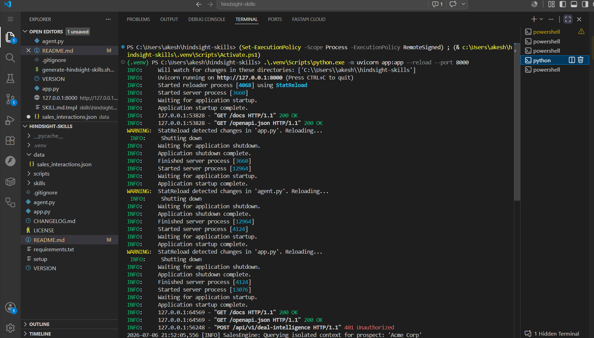
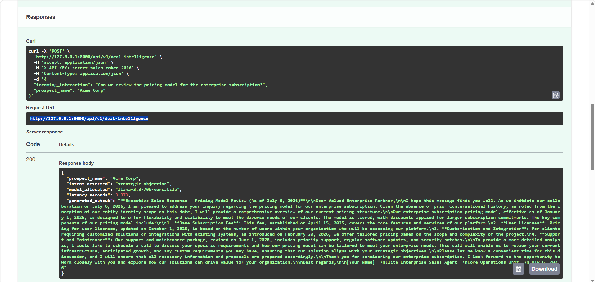

Enterprise Sales Deal Intelligence Agent
An autonomous CRM routing intelligence pipeline built for the Hindsight x cascadeflow Hackathon.

Works natively with Groq LPUs, Python Virtual Environments, and Windows PowerShell.

Most sales tools treat every incoming email or call transcript like a first date—they completely forget historical context between sessions. This agent fixes that. By implementing simulation layers for Hindsight episodic memory and cascadeflow budget-routing, this agent tracks long-term customer friction points and dynamically optimizes API infrastructure expenses on the fly.

⚡ See It Work
1. CLI Local Execution
Run the core pipeline directly via PowerShell to see episodic memory extraction and dynamic model orchestration in action.

Plaintext
PS C:\Users\akesh\hindsight-skills> .\.venv\Scripts\python.exe agent.py

==== PROCESSING TRANSACTION PIPELINE FOR: TECHCORP SOLUTIONS ====
🧠 [Hindsight] Scanning episodic memory bank for historic records regarding 'TechCorp Solutions'...
🔀 [cascadeflow] Standard interaction update. Routing to fast baseline tier.
📊 [Telemetry Audit Trail] Model Used: llama-3.1-8b-instant | Latency: 0.91s
==========================================================================
**Account Status Update:**
Based on our historical conversation, the account is currently stalled due to two key concerns:
1. Integration Bandwidth (as mentioned on 2026-06-25)
2. Pricing Concerns (as mentioned on 2026-06-30)

Subject: A Fresh Perspective on Integration and Pricing...
==========================================================================

==== PROCESSING TRANSACTION PIPELINE FOR: TECHCORP SOLUTIONS ====
🧠 [Hindsight] Scanning episodic memory bank for historic records regarding 'TechCorp Solutions'...
🔀 [cascadeflow] Complex strategic objection detected. Escalating to high-tier engine.
📊 [Telemetry Audit Trail] Model Used: llama-3.3-70b-versatile | Latency: 2.54s
==========================================================================
Subject: Personalized Solution to Address Integration and Pricing Concerns

Dear TechCorp Solutions Team,
As we previously discussed on 2026-06-25, I understand your engineering team is currently overwhelmed with a heavy 3-month integration phase...
2. Live API Server Initialization
The pipeline is fully wrapped as a high-performance REST API using FastAPI. You can spin up the development server with hot-reloading enabled. 
Refer to the terminal trace below to see the Uvicorn server initialization lifecycle, dependency activations, and real-time transaction logging inside the VS Code Terminal environment.

3. Interactive API Sandbox (Swagger UI)
Once the server is running, navigate to the auto-generated documentation backend to test payloads interactively.

Below is a visual inspection of a `POST` request execution trace within the interactive sandbox. The example demonstrates how a strategic pricing query from a prospect (`Acme Corp`) automatically triggers an intent escalation, provisions the `llama-3.3-70b-versatile` engine, and streams back a contextualized executive sales response.

🚀 Production Scaling Roadmap (Next Steps)
If deployed into a live enterprise CRM environment, the system is engineered to scale via the following blueprint:

Neural Knowledge Graphs: Transitioning the flat JSON memory ledger into a managed vector cluster (pgvector/Qdrant) combined with Neo4j for automated relation and entity extraction.

Semantic Router Arrays: Upgrading basic keyword checks to ultra-fast, 10ms embedding-based vector similarity clustering to analyze complex intent nuances.

Event-Driven Workflows: Utilizing Celery and Redis message queues to offload heavy model reasoning tasks from the primary HTTP thread footprint, ensuring sub-second API responsiveness.